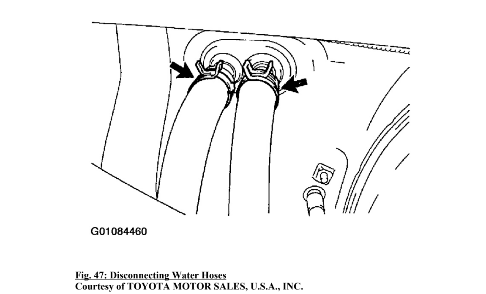

# Temporary Fix for a Leaking Heater Core

As a temporary solution to prevent coolant from leaking into the passenger compartment due to a heater core leak, you can bypass the heater core by disconnecting the two hoses that lead to the heater core and connecting them together with a small metal tube or a suitable hose connector. This will allow the coolant to continue circulating through the engine without passing through the leaking heater core.

## Steps to Bypass the Heater Core

### Safety First

Ensure the engine is completely cool before starting any work to avoid burns from hot coolant.
Disconnect the negative battery terminal to avoid any electrical accidents.  (Optional)

### Locate the Heater Hoses

Identify the two hoses that connect to the heater core. These are typically found on the firewall in the engine compartment.

### Drain Some Coolant  (Optional)

To minimize coolant spillage, you may want to partially drain the coolant from the system using the radiator drain valve.

### Disconnect the Heater Hoses

Use pliers to remove the hose clamps and gently twist and pull the hoses off the heater core fittings on the firewall.

### Connect the Hoses Together

Use a small metal tube or a hose connector of the appropriate size to join the two heater hoses together. Secure the connection with hose clamps to ensure there are no leaks.

### Refill Coolant

Check the coolant level and refill if necessary. Make sure to bleed any air from the cooling system to avoid overheating.

### Check for Leaks

Start the engine and let it reach operating temperature. Check the bypass connection for any signs of leaks.

### Considerations

Temporary Fix: This bypass is a temporary solution and should only be used until you can replace the heater core.

No Cabin Heat: With the heater core bypassed, you will not have cabin heat, which can be uncomfortable in cold weather.

Monitor Coolant Level: Keep an eye on the coolant level and temperature gauge to ensure the engine is not overheating.

### Professional Repair

Replace the Heater Core: Ultimately, you will need to replace the leaking heater core. This is a more involved repair that often requires removing parts of the dashboard to access the heater core.

Bypassing the heater core can effectively stop the leak and allow you to continue using your vehicle without the risk of coolant damaging the interior, but it’s important to address the root cause by replacing the heater core as soon as possible.